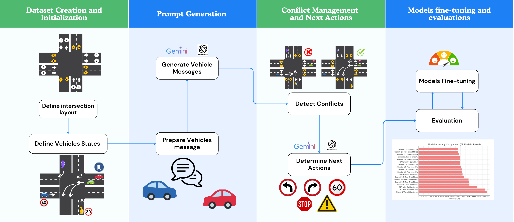
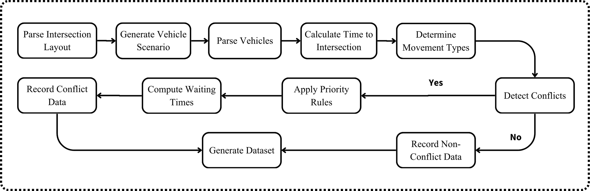
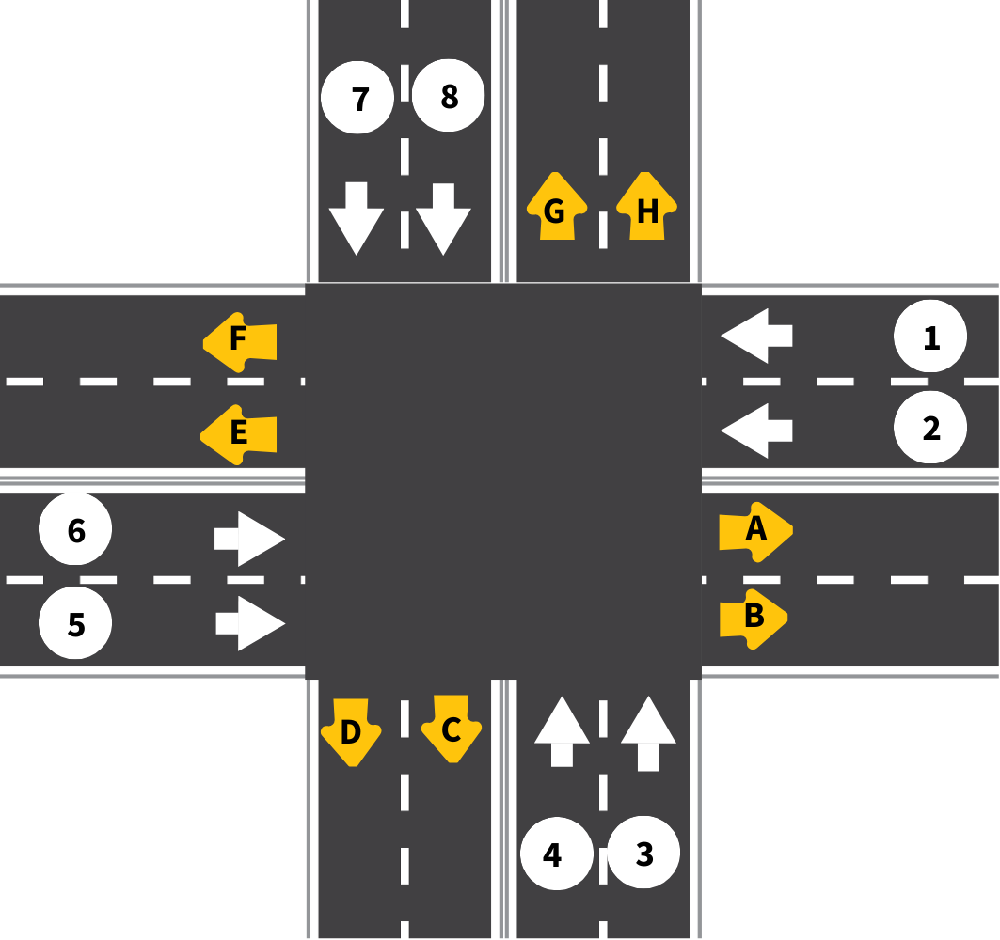
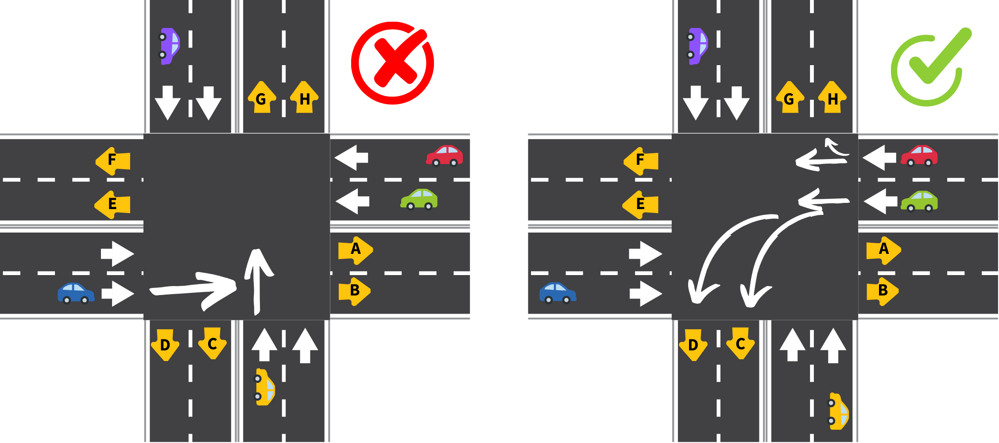

# Intersection Conflict Detection and Management System

This project is designed to detect and manage potential conflicts between vehicles approaching an intersection. By analyzing the trajectories, arrival times, speeds, and directions of vehicles, the system predicts conflicts and calculates necessary wait times to minimize the risk of accidents. The project utilizes advanced AI models for classification tasks and provides both conflict detection and management, following traffic priority rules.

## Related Paper

For further insights and an in-depth explanation of the methodologies used, refer to our research paper on this topic:

**Paper Title**: *Leveraging Large Language Models (LLMs) for Traffic Management at Urban Intersections: The Case of Mixed Traffic Scenarios*

**Authors**: 
- **Sari Masri**:  [s.masri3@student.aaup.edu](mailto:s.masri3@student.aaup.edu), [sarimasri3@gmail.com](mailto:sarimasri3@gmail.com)
- **Huthaifa I. Ashqar**:  [huthaifa.ashqar@aaup.edu](mailto:huthaifa.ashqar@aaup.edu)
- **Mohammed Elhenawy**: [mohammed.elhenawy@qut.edu.au](mailto:mohammed.elhenawy@qut.edu.au)

**Preprint Link**: [https://arxiv.org/abs/2408.00948](https://arxiv.org/abs/2408.00948)

This paper provides a comprehensive overview of how LLMs can be utilized for effective traffic management at complex intersections. It details the system's architecture, data collection methods, conflict classification approach, and performance analysis. The research highlights the challenges and solutions in managing urban traffic through AI-driven intersection conflict detection and management systems.

**Please cite this paper as a reference** if you use or adapt any components of this project for related work.


## Table of Contents

- [Introduction](#introduction)
- [Project Structure](#project-structure)
- [Features](#features)
- [Installation](#installation)
- [Usage](#usage)
  - [Conflict Detection Example](#conflict-detection-example)
  - [Data Generation](#data-generation)
  - [GPT Fine-Tuning for Conflict Classification](#gpt-fine-tuning-for-conflict-classification)
  - [LLAMA Fine-Tuning for Conflict Classification](#llama-fine-tuning-for-conflict-classification)
- [Testing](#testing)
- [Contributing](#contributing)
- [License](#license)
- [Contact](#contact)
- [Additional Information](#additional-information)
- [Acknowledgments](#acknowledgments)
- [Disclaimer](#disclaimer)

## Introduction

Urban intersections are among the most complex and potentially hazardous areas in road networks. Effective management and real-time decision-making at intersections are critical to ensuring smooth traffic flow and reducing the likelihood of accidents. This project aims to develop an intelligent conflict detection and management system for intersections. By analyzing vehicle data, such as speed, distance, direction, and intended movement, the system identifies potential conflicts, prioritizes vehicles based on traffic rules, and calculates waiting times as needed.

Advanced AI models like GPT and LLAMA are fine-tuned to classify intersection conflicts based on vehicle trajectories, contributing to real-time traffic management in autonomous systems. This project serves as a framework for both data generation and model fine-tuning to accurately predict and classify traffic conflicts in dynamic urban settings.

### Workflow of the Proposed Framework
The workflow of this system involves several key steps:
1. **Data Collection**: Gathering real-time data on vehicle speed, distance, direction, and intended movement.
2. **Conflict Detection**: Analyzing trajectories and predicting potential conflicts at intersections.
3. **Conflict Classification**: Using AI models to classify conflicts and prioritize vehicles.
4. **Waiting Time Calculation**: Calculating wait times based on priority rules to ensure safe passage.
5. **Model Fine-Tuning**: Training and fine-tuning AI models for enhanced conflict detection accuracy.



*Figure 1: Workflow illustrating the data collection, conflict detection, and AI-powered classification process.*

### Dataset Creation System Workflow

The dataset creation system uses a structured approach to generate data for intersection scenarios. Here’s an overview of the dataset generation process:


...

*Figure 2: Dataset creation system workflow.*

### Intersection Layout:



*Figure 3: The intersection layout with lanes and destinations.*

The intersection consists of four main directions—north, east, south, and west—each with two lanes guiding vehicles to specific destinations.

### Intersection Conflict Example:



*Figure 4: An example of a conflict at the intersection.*

## Project Structure

The repository is organized as follows:

- `src/`: Source code for conflict detection and data generation.
- `gpt_finetuning/`: Code for fine-tuning GPT models for conflict classification.
- `llama_finetuning/`: Code for fine-tuning LLAMA models for conflict classification.
- `tests/`: Unit tests for the conflict detection system.
- `data/`: Contains the generated dataset and intersection layout.
- `images/`: Contains images used in the documentation.
- `README.md`: Project documentation.
- `requirements.txt`: List of dependencies.
- `LICENSE`: License information.

## Features

- **Conflict Detection**: Identifies potential conflicts between vehicles based on their paths and arrival times.
- **Priority Assignment**: Applies traffic rules to assign priority levels to vehicles.
- **Waiting Time Calculation**: Computes waiting times for vehicles to resolve conflicts.
- **Data Generation**: Generates random vehicle scenarios and datasets for testing.
- **GPT Fine-Tuning**: Fine-tunes GPT models to classify conflicts based on textual descriptions.
- **LLAMA Fine-Tuning**: Fine-tunes LLAMA models to classify conflicts using the Together AI API.
- **Unit Testing**: Comprehensive unit tests to ensure the correctness of the conflict detection logic.

## Installation

1. **Clone the repository:**

   ```bash
   git clone https://github.com/sarimasri3/Intersection-Conflict-Detection.git
   cd Intersection-Conflict-Detection
   ```

2. **Create a virtual environment** (optional but recommended):

   ```bash
   python -m venv venv
   source venv/bin/activate  # On Windows use `venv\Scripts\activate`
   ```

3. **Install dependencies:**

   ```bash
   pip install -r requirements.txt
   pip install -r llama_finetuning/requirements.txt  # For LLAMA-specific dependencies
   ```

Ensure Python 3.6 or higher is installed.

## Usage

### Conflict Detection Example

```python
from src.conflict_detection import parse_vehicles, detect_conflicts, parse_intersection_layout
import json

# Load intersection layout
with open('data/intersection_layout.json', 'r') as f:
    intersection_layout_data = json.load(f)
intersection_layout = parse_intersection_layout(intersection_layout_data)

# Example vehicle scenario
vehicles_scenario_json = '''
{
    "vehicles_scenario": [
        {
            "vehicle_id": "V001",
            "lane": 1,
            "speed": 50,
            "distance_to_intersection": 100,
            "direction": "north",
            "destination": "F"
        },
        {
            "vehicle_id": "V002",
            "lane": 3,
            "speed": 50,
            "distance_to_intersection": 100,
            "direction": "east",
            "destination": "B"
        }
    ]
}
'''
vehicles_scenario_data = json.loads(vehicles_scenario_json)
vehicles = parse_vehicles(vehicles_scenario_data, intersection_layout)

# Detect conflicts
conflicts = detect_conflicts(vehicles)
print(conflicts)
```

### Data Generation

You can generate a dataset of vehicle scenarios using the `data_generation.py` module.

```python
from src.data_generation import generate_dataset

# Generate a dataset with 1000 records and up to 5 vehicles per scenario
dataset = generate_dataset(total_records=1000, num_vehicles=5, fixed_vehicle_count=False)
dataset.to_csv('data/generated_dataset.csv', index=False)
```

## GPT Fine-Tuning for Conflict Classification

This project includes a module for fine-tuning GPT models to classify traffic conflicts at intersections.

### Setup

1. Set your OpenAI API key:

   ```bash
   export OPENAI_API_KEY='your-api-key-here'
   ```

2. Ensure training, validation, and test datasets are in `data/`.

### Run Fine-Tuning

```bash
python gpt_finetuning/fine_tune_gpt.py
```

### Evaluation

```bash
python gpt_finetuning/evaluation.py
```

## LLAMA Fine-Tuning for Conflict Classification

This project includes a module for fine-tuning LLAMA models to classify traffic conflicts at intersections using the Together AI API.

### Setup

1. Set your Together AI API key:

   ```bash
   export TOGETHER_API_KEY='your-together-api-key'
   ```

2. Install additional dependencies:

   ```bash
   pip install -r llama_finetuning/requirements.txt
   ```

### Fine-Tuning the LLAMA Model

Run the fine-tuning script:

```bash
python run_llama_fine_tuning.py
```

### Evaluating the Fine-Tuned LLAMA Model

```bash
python run_llama_evaluation.py
```

## Testing

Run unit tests using:

```bash
python -m unittest discover tests
```

## Contributing

Refer to previous instructions for contributing and testing.

## License

This project is licensed under the MIT License - see the LICENSE file for details.

## Contact

For any questions, suggestions, or feedback, please reach out:

- **Sari Masri**: sarimasri3@gmail.com
- **Huthaifa I. Ashqar**: Huthaifa.ashqar@aaup.edu

## Additional Information

Include `requirements.txt` with dependencies:

```plaintext
openai
pandas
scikit-learn
matplotlib
seaborn
json
warnings
unittest
math
random
requests
python-dotenv
together
```

To generate:

```bash
pip freeze > requirements.txt
```
